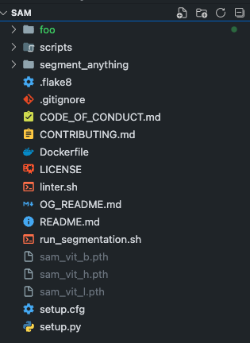

# Segment Anything Model Docker Setup

## Model Checkpoints

Before building the docker Image, download and rename the model checkpoints. Place them in the base directory:

- For the ViT-H model: `sam_vit_h.pth` - [Download here](https://dl.fbaipublicfiles.com/segment_anything/sam_vit_h_4b8939.pth)
- For the ViT-L model: `sam_vit_l.pth` - [Download here](https://dl.fbaipublicfiles.com/segment_anything/sam_vit_l_0b3195.pth)
- For the ViT-B model: `sam_vit_b.pth` - [Download here](https://dl.fbaipublicfiles.com/segment_anything/sam_vit_b_01ec64.pth)

Something like this:



Copy the required model into the Docker image as specified in the Dockerfile.

## Running the Docker Container

1. Ensure Docker is operational on your system.
2. Build the Docker image:

```
   docker build -t segment-anything .
```

3. To run the Docker container and segment an image, use the following command format:

If The host has CUDA support and NVIDIA drivers and toolkit installed:

`docker run --gpus all -v "$(pwd)/{image_folder_name}:/app/data" segment-anything ./run_segmentation.sh {model_path} {model_name} {image_name}`

If the device is CPU:

`docker run -v "$(pwd)/{image_folder_name}:/app/data" segment-anything ./run_segmentation.sh {model_path} {model_name} {image_name} cpu`

Where:

- `{image_folder_name}` is the name of the folder in your current working directory containing the images (e.g. 'foo').
- `{model_path}` is the path to the model file being used (e.g. 'sam_vit_b.pth','sam_vit_h.pth','sam_vit_l.pth').
- `{model_name}` is the name of the model (e.g. 'vit_b','vit_h','vit_l').
- `{image_name}` is the filename of the image inside the `{image_folder_name}` on which the model will perform segmentation.(e.g. 'dogs.jpg')

Here's an example command

for gpu:

```
docker run --gpus all -v "$(pwd)/foo:/app/data" segment-anything ./run_segmentation.sh sam_vit_b.pth vit_b dogs.jpg
```

for cpu:

```
docker run -v "$(pwd)/foo:/app/data" segment-anything ./run_segmentation.sh sam_vit_b.pth vit_b dogs.jpg cpu
```

In these examples, I have used docker volume to use 'foo' folder to be mounted inside the container. Any changes made by container to the folder will be reflected to the host as well.

Docker Image Size with all dependency and model checkpoints:

- with sam_vit_b model = 1.51 GB
- with sam_vit_l model = 2.39 GB
- with sam_vit_h model = 3.7 GB

I have used `python:3.8-slim` as the base image to keep the size small and only install the dependency for the model.

## (Optional) Building Image without model checkpoints

If we want to reduce the image size even further, we can build the image without model checkpoints and then use docker volume mounting to access the model checkpoint files (sam_vit_b.pth/sam_vit_l.pth etc) directly from the host.

A sample command for that:

```
docker run -v "$(pwd):/app/models" -v "$(pwd)/foo:/app/data" segment-anything ./run_segmentation.sh /models/sam_vit_l.pth vit_l dogs.jpg cpu
```

In this case, Docker Image Size with all dependency:

- WITHOUT model checkpoints = 1.14 GB
